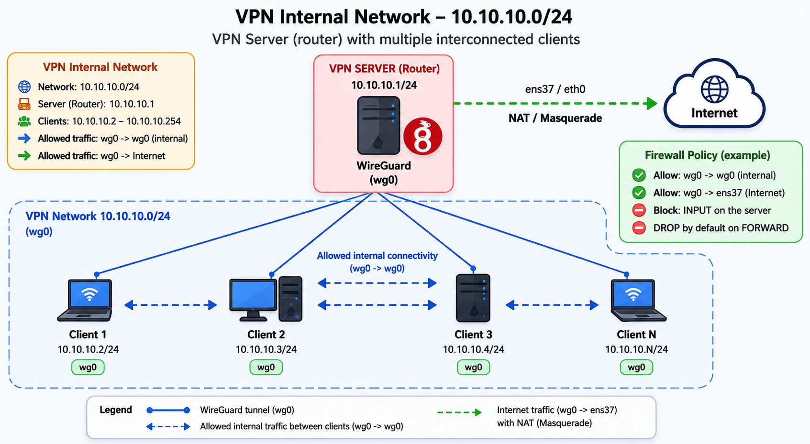
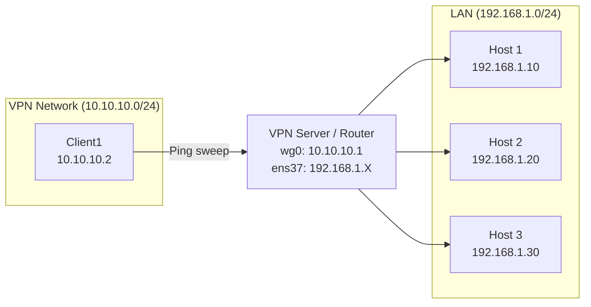
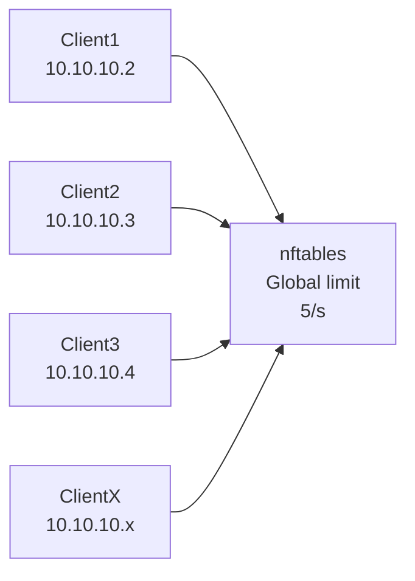
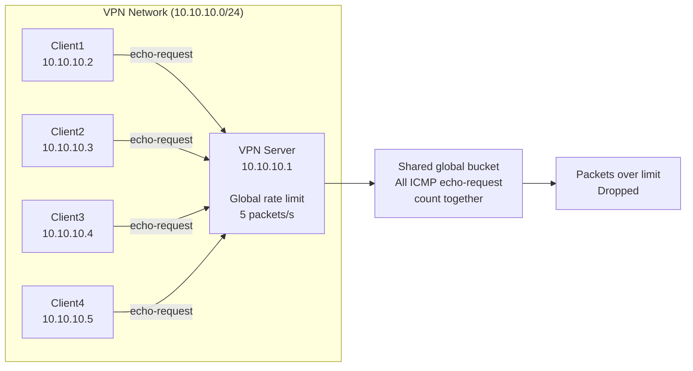

# Echo Discovery (ping sweep)

En la configuración actual de la VPN no aplica el descubrimiento lateral mediante ping sweep, ya que el forwarding `wg0` -> `wg0` está bloqueado y solo se permite de `wg0` a `ens37`.

Sin embargo, en escenarios donde la VPN se utiliza como red interna compartida (cliente <-> cliente), el descubrimiento de hosts mediante ICMP puede facilitar enumeración a gran escala y reconocimiento de la red interna.

----

## Tabla de Contenido

- [Escenario](#escenario)
- [Pruebas](#pruebas)
- [Mitigación](#mitigación)
- [Limitaciones de la Mitigación](#limitaciones-de-la-mitigación)
    - [Evasión Mediante Reducción de Velocidad](#evasión-mediante-reducción-de-velocidad)
    - [Limitación del Rate Limiting Global](#limitación-del-rate-limiting-global)

----

## Escenario

Para analizar este caso vamos a utilizar el siguiente escenario:



- En la imagen anterior se representa una red interna compartida. Imaginemos que la máquina `Client1` ha sido comprometida y se utiliza un barrido de ping (ping sweep) para enumerar hosts activos e intentar facilitar movimiento lateral dentro de la red.

- En las pruebas prácticas se recreará este escenario utilizando la interfaz `ens37`, ya que proporciona acceso a mi red local y permitirá simular el comportamiento de una red interna compartida similar al caso planteado:



- Nuestra configuración actual del firewall para el hook `forward` es la siguiente:

```
[albr@albr-arch ~]$ cat /etc/nftables.conf
#!/usr/bin/nft -f

flush ruleset

define WG_IF = wg0
define EXT_IF = ens37
-----------------CUT----------------
chain forward {
    type filter hook forward priority 0;
    policy drop;

    ip saddr @ip_blacklist drop

    ct state established,related accept

    iifname $WG_IF oifname $EXT_IF accept
}
-----------------CUT----------------
```

- Esta configuración permite el tráfico de `wg0` a `ens37`, para ver cómo se comporta el tráfico al realizar un barrido de ping vamos a crear una chain `wg0-ens37` y enviar todo este tráfico hacia allí:

```
chain forward {
    type filter hook forward priority 0;
    policy drop;

    ct state established,related accept

    iifname $WG_IF oifname $EXT_IF jump wg0-ens37

}

chain wg0-ens37 {
    icmp type echo-request counter accept
    icmp type echo-reply counter accept
    accept
}
```

- Para monitorear vamos a añadir dos reglas que detecten los paquetes icmp de tipo 8 (echo-request) y de tipo 0 (echo-reply), y le añadiremos counters.

- También vamos a crear lo mismo pero para los paquetes que regresen y lo vamos a colocar encima de la regla `ct state established,related accept` ya que esta impedirá que veamos las respuestas a nuestros `echo-request`

```
chain forward {
    type filter hook forward priority 0;
    policy drop;

    iifname $EXT_IF oifname $WG_IF jump ens37-wg0
    iifname $WG_IF oifname $EXT_IF jump wg0-ens37

    ct state established,related accept
}

chain wg0-ens37 {
    icmp type echo-request counter accept
    icmp type echo-reply counter accept
    accept
}   

chain ens37-wg0 {
    icmp type echo-request counter accept
    icmp type echo-reply counter accept
    accept
}
```
## Pruebas

- Ahora que lo tenemos todo preparado podemos lanzar el barrido ping desde nuestro cliente ubuntu a la red interna:

```
albr@Ubuntu-Server:~$ time fping -ag 192.168.1.0/24 2>/dev/null
192.168.1.1
192.168.1.21
192.168.1.13
192.168.1.43
192.168.1.66
192.168.1.89

real    0m9.968s
user    0m0.022s
sys     0m0.124s
```
- En aproximadamente 10 segundos se identificaron 6 hosts activos dentro del segmento de red analizado.

- Al revisar los counters vemos lo siguiente:

```
chain wg0-ens37 {
    icmp type echo-request counter packets 994 bytes 83496 accept
    icmp type echo-reply counter packets 0 bytes 0 accept
    counter accept
}

chain ens37-wg0 {
    icmp type echo-request counter packets 6 bytes 504 accept
    icmp type echo-reply counter packets 6 bytes 504 accept
    counter accept
}      
```

- Se localizaron 6 hosts activos y estos respondieron con `echo-reply`, lo raro es que también nos reporta 6 paquetes icmp de tipo `echo-request`, para analizar esto podemos modificar las reglas para que también filtren por IP de origen y así evitar errores:

```
chain wg0-ens37 {
    ip saddr 10.10.10.0/24 icmp type echo-reply counter accept
    ip saddr 10.10.10.0/24 icmp type echo-request counter accept
    counter accept
}

chain ens37-wg0 {
    ip saddr 192.168.1.0/24 icmp type echo-reply counter accept
    ip saddr 192.168.1.0/24 icmp type echo-request counter accept
    counter accept
}
```

- Al repetir la prueba vemos lo siguiente:

```
albr@Ubuntu-Server:~$ time fping -ag 192.168.1.0/24 2>/dev/null
192.168.1.1
192.168.1.21
192.168.1.13
192.168.1.43
192.168.1.66
192.168.1.89
192.168.1.98

real    0m9.910s
user    0m0.009s
sys     0m0.141s
```

```
chain wg0-ens37 {
    ip saddr 10.10.10.0/24 icmp type echo-request counter packets 991 bytes 83244 accept
    ip saddr 10.10.10.0/24 icmp type echo-reply counter packets 0 bytes 0 accept
    counter packets 0 bytes 0 accept
}

chain ens37-wg0 {
    ip saddr 192.168.1.0/24 icmp type echo-reply counter packets 7 bytes 588 accept
    ip saddr 192.168.1.0/24 icmp type echo-request counter packets 0 bytes 0 accept
    counter packets 0 bytes 0 accept
}
```

- Como podemos ver ahora solo recibimos paquetes icmp de tipo `echo-reply`, lo que nos indica que nuestras reglas eran demasiado amplias.

Al analizar los datos observamos que se enviaron cerca de 1000 paquetes en aproximadamente 10 segundos, que equivale a unos 100 paquetes ICMP `echo-request` por segundo. Aunque este volumen de tráfico no necesariamente implica que sea actividad maliciosa, representa una frecuencia significativamente superior al comportamiento habitual de un cliente VPN en uso normal. 
Este patrón puede aparecer en tareas legítimas como monitorización, diagnóstico o descubrimiento de red realizado por administradores, pero también en técnicas de enumeración y reconocimiento de hosts internos.

## Mitigación

- Para intentar mitigar este comportamiento como se indica en [Recommendations for filtering ICMP messages](https://datatracker.ietf.org/doc/html/draft-ietf-opsec-icmp-filtering-04#section-2.2.1) puede utilizarse [rate limiting](https://wiki.nftables.org/wiki-nftables/index.php/Rate_limiting_matchings) en nftables con el objetivo de reducir barridos masivos de descubrimiento sin bloquear completamente el tráfico ICMP legítimo.

- Podemos añadir la siguiente regla a nuestra chain:
`icmp type echo-request limit rate over 5/second burst 5 packets drop`

    - Esta regla descarta paquetes `echo-request` que superen el límite configurado, permitiendo pequeñas ráfagas temporales (`burst`) antes de aplicar el bloqueo.

- Para probar la efectividad de esto podemos añadirlo a nuestra chain de igual forma que anteriormente:

```
chain wg0-ens37 {
    ip saddr 10.10.10.0/24 icmp type echo-request limit rate over 5/second burst 5 packets counter drop
    ip saddr 10.10.10.0/24 icmp type echo-request counter accept
    ip saddr 10.10.10.0/24 icmp type echo-reply counter accept
    counter accept
}
```
- De esta forma veremos cuantos paquetes se descartan y cuantos se aceptan.

- Repetimos la prueba:

```
albr@Ubuntu-Server:~$ time fping -ag 192.168.1.0/24 2>/dev/null
192.168.1.1

real    0m9.857s
user    0m0.016s
sys     0m0.124s
```

```
chain wg0-ens37 {
    ip saddr 10.10.10.0/24 icmp type echo-request limit rate over 5/second burst 5 packets counter packets 964 bytes 80976 drop
    ip saddr 10.10.10.0/24 icmp type echo-request counter packets 45 bytes 3780 accept

    ip saddr 10.10.10.0/24 icmp type echo-reply counter packets 0 bytes 0 accept
    counter packets 0 bytes 0 accept
}
```

- Como podemos ver identificamos solamente un host activo y los counters nos indican que se descartaron 964 paquetes y solo se aceptaron 45


> Nota: Este umbral resulta extremadamente restrictivo y degrada significativamente la capacidad de descubrimiento, llegando incluso a impedir el funcionamiento normal de herramientas de diagnóstico. En entornos reales, el valor debe ajustarse según el contexto operativo y el volumen esperado de tráfico ICMP.

## Limitaciones de la Mitigación

### Evasión Mediante Reducción de Velocidad

- Aunque esta configuración es efectiva contra escaneos masivos, un atacante podría seguir realizando barridos de ping pero limitando la cantidad de paquetes enviados como se muestra a continuación:

```
albr@Ubuntu-Server:~$ time fping -i 200 -r 0 -ag 192.168.1.0/24 2>/dev/null
192.168.1.1
192.168.1.13
192.168.1.21
192.168.1.43
192.168.1.66
192.168.1.68
192.168.1.89
192.168.1.98

real    0m51.263s
user    0m0.010s
sys     0m0.074s
```

-  Con el parámetro `-i` indicamos el intervalo de paquetes en milisegundos, en este caso 200 ms que es alrededor de 5 paquetes por segundo y con `-r 0` indicamos que no reintente con ningún host.

```
chain wg0-ens37 {
    ip saddr 10.10.10.0/24 icmp type echo-request limit rate over 5/second burst 5 packets counter packets 0 bytes 0 drop
    ip saddr 10.10.10.0/24 icmp type echo-request counter packets 253 bytes 21252 accept
    ip saddr 10.10.10.0/24 icmp type echo-reply counter packets 0 bytes 0 accept
    counter packets 0 bytes 0 accept
}

chain ens37-wg0 {
    ip saddr 192.168.1.0/24 icmp type echo-reply counter packets 8 bytes 672 accept
    ip saddr 192.168.1.0/24 icmp type echo-request counter packets 0 bytes 0 accept
    counter packets 0 bytes 0 accept
}
```

- Como podemos ver no se descartó ningún paquete y se aceptaron `253` por lo que pudimos adaptarnos a la mitigación y de igual forma ejecutar con éxito el barrido de ping.

- También observamos que el escaneo pasó de ejecutarse en casi 10 segundos a 51 segundos, aunque no es mucho tiempo, en rangos de red más amplios esto podría aumentar significativamente, por ejemplo imaginemos el siguiente rango `192.168.0.0/16`, para realizar un barrido de ping completo a esta red tendríamos que enviar `65.534` paquetes `echo-request`, enviando 5 paquetes por segundo tardaríamos alrededor de 3 horas y media realizar el escaneo completo.

### Limitación del Rate Limiting Global

- Actualmente el firewall aplica un límite global de `5 paquetes por segundo` sobre todos los paquetes ICMP `echo-request` provenientes de la red VPN. Esto significa que todos los clientes comparten el mismo límite.



- Como consecuencia, si varios clientes generan tráfico ICMP echo-request a la vez, el firewall contabilizará todos los paquetes de forma conjunta, independientemente del host de origen. Esto puede provocar que tráfico legítimo sea descartado:



- Por ejemplo, si realizamos un barrido de ping con `fping` desde dos clientes distintos, limitando cada uno a aproximadamente `5 paquetes por segundo`, ocurre lo siguiente:

Client1:
```
albr@Ubuntu-Server:~$ fping -i 200 -r 0 -ag 192.168.1.0/24 2>/dev/null
192.168.1.1
192.168.1.13
192.168.1.21
192.168.1.43
192.168.1.94
```

Client2:
```
albr@Ubuntu2:~$ fping -i 200 -r 0 -ag 192.168.1.0/24 2>/dev/null
192.168.1.1
192.168.1.66
192.168.1.89
192.168.1.94
192.168.1.98
```

Counters:
```
chain wg0-ens37 {
    ip saddr 10.10.10.0/24 icmp type echo-request limit rate over 5/second burst 5 packets counter packets 245 bytes 20580 drop
    ip saddr 10.10.10.0/24 icmp type echo-request counter packets 261 bytes 21924 accept
    
    ip saddr 10.10.10.0/24 icmp type echo-reply counter packets 0 bytes 0 accept
    counter packets 1 bytes 216 accept
}
```

- Como podemos ver ambos hosts obtuvieron diferentes resultados y los counters nos muestran que se descartaron `245` paquetes y se aceptaron `261`.
    - Aunque cada cliente intentaba mantenerse dentro del límite configurado, ambos flujos compartían el mismo bucket global de `rate limiting`. Al ejecutarse simultáneamente, la suma del tráfico superó el límite de 5 paquetes por segundo, provocando el descarte de parte del tráfico legítimo.

- Para resolver esta limitación podemos aplicar el rate limiting de forma independiente por dirección IP de origen, para esto vamos a utilizar un `meter` en `nftables` como se muestra a continuación:

```
chain wg0-ens37 {
    ip saddr 10.10.10.0/24 icmp type echo-request meter icmp_ipsaddr { ip saddr limit rate over 5/second burst 5 packets } counter drop

    ip saddr 10.10.10.0/24 icmp type echo-request counter accept
    ip saddr 10.10.10.0/24 icmp type echo-reply counter accept
    counter accept
}
```

- Esta regla agrupa el tráfico por dirección IP de origen. De esta forma, cada cliente dispone de su propio bucket de `rate limiting`, por lo que solo se descartarán paquetes cuando una misma IP supere el límite establecido.

Client1:
```
albr@Ubuntu-Server:~$ fping -i 200 -r 0 -ag 192.168.1.0/24 2>/dev/null
192.168.1.1
192.168.1.13
192.168.1.21
192.168.1.43
192.168.1.66
192.168.1.68
192.168.1.89
192.168.1.94
192.168.1.98
```

Client2:
```
albr@Ubuntu2:~$ fping -i 200 -r 0 -ag 192.168.1.0/24 2>/dev/null
192.168.1.1
192.168.1.13
192.168.1.21
192.168.1.43
192.168.1.66
192.168.1.68
192.168.1.89
192.168.1.94
192.168.1.98
```

Counters:
```
[albr@albr-arch ~]$ sudo nft list ruleset

---------------------CUT-----------------------

set icmp_ipsaddr {
    type ipv4_addr
    size 65535      # count 2
    flags dynamic
    elements = { 10.10.10.2 limit rate over 5/second burst 5 packets, 10.10.10.3 limit rate over 5/second burst 5 packets }
}

chain wg0-ens37 {
    ip saddr 10.10.10.0/24 icmp type echo-request add @icmp_ipsaddr { ip saddr limit rate over 5/second burst 5 packets } counter packets 0 bytes 0 drop
    ip saddr 10.10.10.0/24 icmp type echo-request counter packets 506 bytes 42504 accept
    ip saddr 10.10.10.0/24 icmp type echo-reply counter packets 0 bytes 0 accept
    counter packets 1 bytes 216 accept
}

---------------------CUT------------------------
```
> Nota: Al listar el ruleset, `nftables` representa internamente el `meter` como un set dinámico (`add @icmp_ipsaddr`).

- Como podemos observar el escaneo arrojó los mismos resultados en ambos hosts y se aceptaron todos los paquetes ya que ninguno superó el límite. También se creó un set dinámico donde se evalúa el tráfico agrupándolo por su IP de origen.

## Conclusiones

- Los barridos de ping mediante ICMP `echo-request` permiten identificar rápidamente hosts activos y facilitar tareas de enumeración y reconocimiento de red.

- El uso de `rate limiting` en `nftables` permite degradar significativamente este comportamiento sin bloquear completamente el tráfico ICMP legítimo.

- Un límite global puede provocar el descarte de tráfico legítimo cuando varios clientes comparten el mismo bucket de limitación.

- El uso de `meters` permite aplicar el `rate limiting` de forma independiente por dirección IP de origen, reduciendo el impacto sobre otros clientes de la VPN.

- Ninguna de estas medidas impide completamente el descubrimiento mediante ping sweep; un atacante puede adaptar la velocidad del escaneo para evadir parcialmente la mitigación a costa de incrementar el tiempo necesario para el reconocimiento.